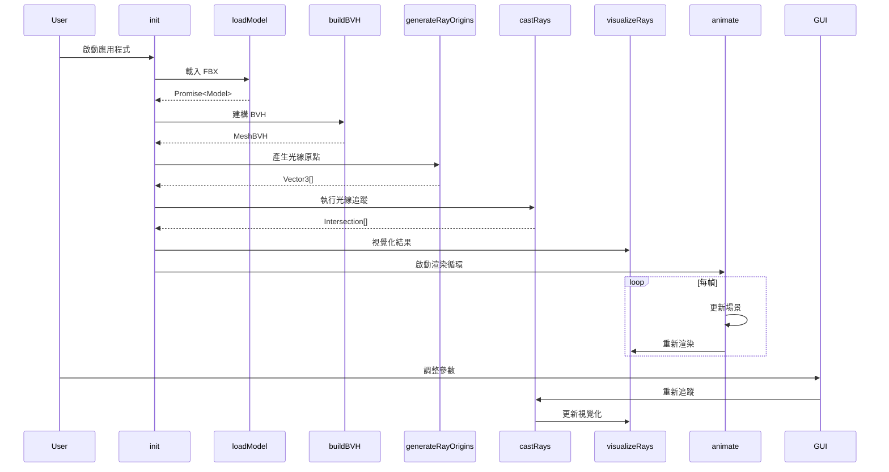

# Component Interface: WebGL Raycaster BVH

**Feature**: 8-raycaster-bvh  
**Date**: 2025-01-XX

---

## Overview

此文件定義 WebGL Raycaster BVH 應用程式的核心函式介面規格。本專案為單一 HTML 檔案結構，所有介面定義為 JavaScript 內部函式。

---

## Core Functions Interface

### init()

初始化 3D 場景和所有元件。

```typescript
function init(): void
```

**Responsibilities**:
1. 建立場景、攝影機、渲染器
2. 建立 LoadingState 管理器
3. 初始化 GUI 控制介面
4. 初始化 Stats.js 性能監控
5. 建立 PerformanceMonitor
6. 啟動模型載入流程

**Side Effects**:
- 建立 PerspectiveCamera (fov: 60, near: 0.1, far: 100)
- 建立 THREE.Scene (background: 0x000000)
- 建立 WebGLRenderer
- 建立 OrbitControls
- 顯示載入進度 UI
- 綁定 window resize 事件
- 呼叫 loadModel()

---

### loadModel(url: string, onProgress?: Function)

載入 FBX 模型。

```typescript
function loadModel(
    url: string,                           // FBX 檔案路徑
    onProgress?: (percent: number) => void // 進度回呼 (可選)
): Promise<THREE.Group>
```

**Parameters**:
| Name | Type | Description |
|------|------|-------------|
| url | string | FBX 模型的 URL (相對或絕對路徑) |
| onProgress | Function? | 載入進度回呼 (0-100) |

**Returns**:
- `Promise<THREE.Group>`: 解析為載入的模型群組

**Behavior**:
1. 建立 FBXLoader 實例
2. 建立 LoadingManager 並綁定進度監聽器
3. 設定 60 秒超時計時器
4. 執行非同步載入
5. 成功後回傳模型群組

**Error Handling**:
- 載入失敗 → reject with error
- 超時 (>60s) → reject with TimeoutError

**Example**:
```javascript
loadModel('https://threejs.org/examples/models/fbx/stanford-bunny.fbx', (percent) => {
    console.log(`載入進度：${percent}%`);
})
.then(model => {
    scene.add(model);
    buildBVH(model);
})
.catch(error => {
    showError('模型載入失敗');
});
```

---

### buildBVH(mesh: THREE.Mesh, options?: BVHOptions)

為網格建構 BVH 加速結構。

```typescript
interface BVHOptions {
    strategy?: 'CENTER' | 'AVERAGE' | 'SAH';
    maxDepth?: number;
    maxLeafTris?: number;
    verbose?: boolean;
}

function buildBVH(
    mesh: THREE.Mesh,
    options?: BVHOptions
): MeshBVH
```

**Parameters**:
| Name | Type | Default | Description |
|------|------|---------|-------------|
| mesh | Mesh | - | 目標網格物件 |
| options.strategy | string | 'CENTER' | BVH 分割策略 |
| options.maxDepth | number | 40 | 最大樹深度 |
| options.maxLeafTris | number | 10 | 葉節點最大三角形數 |
| options.verbose | boolean | false | 是否輸出建構日誌 |

**Returns**:
- `MeshBVH`: 建構完成的 BVH 物件

**Side Effects**:
- 修改 `mesh.geometry.boundsTree` 屬性
- 替換 `mesh.raycast` 方法為 `acceleratedRaycast`

**Performance**:
- 預期建構時間: <500ms (70k triangles)

**Example**:
```javascript
const bvh = buildBVH(bunnyMesh, {
    strategy: 'CENTER',
    maxDepth: 40,
    maxLeafTris: 10
});

console.log(`BVH 建構完成，樹深度：${bvh.maxDepth}`);
```

---

### generateRayOrigins(count: number, radius: number): THREE.Vector3[]

產生光線原點位置陣列。

```typescript
function generateRayOrigins(
    count: number,     // 光線數量
    radius: number     // 球面半徑
): THREE.Vector3[]
```

**Parameters**:
| Name | Type | Description |
|------|------|-------------|
| count | number | 光線數量 (建議 1-200) |
| radius | number | 球面半徑 (建議 5-10) |

**Returns**:
- `Vector3[]`: 均勻分布的球面座標陣列

**Algorithm**:
- 使用 Fibonacci 球面採樣演算法
- 保證均勻分布，無聚集現象

**Example**:
```javascript
const origins = generateRayOrigins(100, 5);
// origins[0] = Vector3(x, y, z) 在半徑 5 的球面上
```

---

### castRays(mesh: THREE.Mesh, origins: THREE.Vector3[]): Intersection[]

執行光線追蹤查詢。

```typescript
interface Intersection {
    point: THREE.Vector3;   // 交點座標
    distance: number;       // 距離原點的距離
    object: THREE.Mesh;     // 交到的物件
    face: THREE.Face;       // 交到的面
    faceIndex: number;      // 面索引
}

function castRays(
    mesh: THREE.Mesh,
    origins: THREE.Vector3[]
): Intersection[]
```

**Parameters**:
| Name | Type | Description |
|------|------|-------------|
| mesh | Mesh | 目標網格 (必須有 boundsTree) |
| origins | Vector3[] | 光線原點陣列 |

**Returns**:
- `Intersection[]`: 交點資訊陣列 (長度 ≤ origins.length)

**Behavior**:
1. 為每個原點建立 Raycaster
2. 計算方向向量 (朝向模型中心)
3. 執行 raycaster.intersectObject(mesh)
4. 收集第一個交點 (如果有)

**Performance**:
- 100 條光線約 1-2ms (with BVH)
- 100 條光線約 50-100ms (without BVH)

---

### visualizeRays(origins: THREE.Vector3[], intersections: Intersection[]): void

視覺化光線和交點。

```typescript
function visualizeRays(
    origins: THREE.Vector3[],
    intersections: Intersection[]
): void
```

**Parameters**:
| Name | Type | Description |
|------|------|-------------|
| origins | Vector3[] | 光線原點陣列 |
| intersections | Intersection[] | 交點資訊陣列 |

**Side Effects**:
1. 更新 RayOrigins InstancedMesh 的實例矩陣
2. 清除舊的光線 Line 物件
3. 建立新的光線 Line 物件並加入場景
4. 更新 IntersectionPoints InstancedMesh

**Performance**:
- 更新時間: <5ms (100 rays)

---

### updateRayCount(count: number): void

更新光線數量並重新執行光線追蹤。

```typescript
function updateRayCount(count: number): void
```

**Parameters**:
| Name | Type | Range | Description |
|------|------|-------|-------------|
| count | number | 1-200 | 新的光線數量 |

**Behavior**:
1. 清除現有光線視覺化
2. 產生新的光線原點
3. 執行光線追蹤
4. 更新視覺化

**Triggers**:
- GUI 控制項變更

---

### toggleBVH(enabled: boolean): void

啟用或停用 BVH 加速。

```typescript
function toggleBVH(enabled: boolean): void
```

**Parameters**:
| Name | Type | Description |
|------|------|-------------|
| enabled | boolean | true = 啟用 BVH, false = 停用 BVH |

**Behavior**:
1. 如果 enabled = true:
   - 呼叫 `mesh.geometry.computeBoundsTree()`
   - 設定 `mesh.raycast = acceleratedRaycast`
2. 如果 enabled = false:
   - 呼叫 `mesh.geometry.disposeBoundsTree()`
   - 恢復 `mesh.raycast = originalRaycast`
3. 重新執行光線追蹤以更新性能

**Performance Impact**:
- 啟用 BVH: FPS 60+ (100 rays)
- 停用 BVH: FPS 10-20 (100 rays)

---

### toggleBVHHelper(visible: boolean): void

切換 BVH 視覺化輔助器。

```typescript
function toggleBVHHelper(visible: boolean): void
```

**Parameters**:
| Name | Type | Description |
|------|------|-------------|
| visible | boolean | 是否顯示 BVH Helper |

**Behavior**:
1. 如果 visible = true:
   - 建立 MeshBVHHelper (如果不存在)
   - 設定深度和顏色
   - 加入場景
2. 如果 visible = false:
   - 隱藏 Helper (不刪除)

---

### updateBVHHelper(depth: number): void

更新 BVH Helper 顯示深度。

```typescript
function updateBVHHelper(depth: number): void
```

**Parameters**:
| Name | Type | Range | Description |
|------|------|-------|-------------|
| depth | number | 1-20 | BVH 樹顯示深度 |

**Behavior**:
1. 檢查 BVHHelper 是否存在
2. 更新 `helper.depth` 屬性
3. 呼叫 `helper.update()` 重新建構視覺化

---

### clearRays(): void

清除所有光線視覺化元素。

```typescript
function clearRays(): void
```

**Behavior**:
1. 移除所有 Line 物件
2. 重設 RayOrigins InstancedMesh count 為 0
3. 重設 IntersectionPoints InstancedMesh count 為 0

---

### showError(message: string): void

顯示錯誤訊息 UI。

```typescript
function showError(message: string): void
```

**Parameters**:
| Name | Type | Description |
|------|------|-------------|
| message | string | 錯誤訊息文字 |

**Behavior**:
1. 建立或顯示錯誤 UI 元素
2. 設定訊息內容
3. 提供「重新載入」按鈕

---

### onWindowResize(): void

處理視窗大小變更。

```typescript
function onWindowResize(): void
```

**Behavior**:
1. 更新 camera.aspect = window.innerWidth / window.innerHeight
2. 呼叫 camera.updateProjectionMatrix()
3. 更新 renderer.setSize(window.innerWidth, window.innerHeight)
4. 更新 GUI 位置 (小螢幕摺疊)

---

### animate(): void

主動畫迴圈。

```typescript
function animate(): void
```

**Behavior**:
1. requestAnimationFrame(animate)
2. stats.begin()
3. 計算 deltaTime
4. 更新 PerformanceMonitor
5. 如果 params.animate = true: 旋轉模型
6. controls.update()
7. renderer.render(scene, camera)
8. stats.end()

---

## Event Handlers

### GUI Change Events

```typescript
// 光線數量變更
gui.add(params, 'rayCount', 1, 200, 1).onChange((value: number) => {
    updateRayCount(value);
});

// BVH 啟用切換
gui.add(params, 'enableBVH').onChange((value: boolean) => {
    toggleBVH(value);
});

// BVH Helper 顯示切換
gui.add(params, 'showBVHHelper').onChange((value: boolean) => {
    toggleBVHHelper(value);
});

// BVH Helper 深度調整
gui.add(params, 'helperDepth', 1, 20, 1).onChange((value: number) => {
    updateBVHHelper(value);
});

// 光線透明度調整
gui.add(params, 'rayOpacity', 0, 1, 0.1).onChange((value: number) => {
    rayMaterial.opacity = value;
});
```

---

## Performance Monitoring Interface

### PerformanceMonitor Class

```typescript
class PerformanceMonitor {
    fpsHistory: number[];
    historySize: number;
    avgFPS: number;
    warningThreshold: number;
    warningActive: boolean;
    warningElement: HTMLDivElement;
    
    constructor();
    update(deltaTime: number): number;
    showWarning(): void;
    hideWarning(): void;
    reset(): void;
}
```

#### update(deltaTime: number): number

更新性能指標。

**Parameters**:
| Name | Type | Description |
|------|------|-------------|
| deltaTime | number | 距離上一幀的時間 (秒) |

**Returns**:
- `number`: 當前平均 FPS

**Behavior**:
1. 計算當前 FPS = 1 / deltaTime
2. 加入 fpsHistory 陣列
3. 計算平均 FPS
4. 檢查是否需要顯示警告 (< 30 FPS)

---

## Loading State Interface

### LoadingState Class

```typescript
class LoadingState {
    status: 'idle' | 'loading' | 'building' | 'ready' | 'error' | 'timeout';
    progress: number;
    message: string;
    startTime: number;
    timeoutId: number;
    
    constructor();
    setStatus(status: string, message?: string): void;
    setProgress(percent: number): void;
    startTimeout(duration: number, callback: Function): void;
    clearTimeout(): void;
}
```

#### setStatus(status, message?)

設定載入狀態。

**Parameters**:
| Name | Type | Description |
|------|------|-------------|
| status | LoadingStatus | 新的狀態 |
| message | string? | 狀態訊息 (可選) |

**Side Effects**:
- 更新 UI 元素文字內容
- 根據狀態顯示/隱藏元素

---

## Type Definitions

### BVHOptions

```typescript
interface BVHOptions {
    strategy?: 'CENTER' | 'AVERAGE' | 'SAH';
    maxDepth?: number;
    maxLeafTris?: number;
    setBoundingBox?: boolean;
    verbose?: boolean;
}
```

### GUIParams

```typescript
interface GUIParams {
    rayCount: number;
    enableBVH: boolean;
    showBVHHelper: boolean;
    helperDepth: number;
    rayOpacity: number;
    animate: boolean;
}
```

### Intersection (from THREE.Raycaster)

```typescript
interface Intersection {
    distance: number;
    point: THREE.Vector3;
    object: THREE.Object3D;
    face: THREE.Face | null;
    faceIndex: number | null;
    uv?: THREE.Vector2;
}
```

---

## Constants

```typescript
// 場景設定
const CAMERA_FOV = 60;
const CAMERA_NEAR = 0.1;
const CAMERA_FAR = 100;
const CAMERA_INITIAL_POSITION = new THREE.Vector3(10, 10, 10);

// BVH 設定
const BVH_STRATEGY = 'CENTER';
const BVH_MAX_DEPTH = 40;
const BVH_MAX_LEAF_TRIS = 10;

// 光線設定
const DEFAULT_RAY_COUNT = 100;
const RAY_SPHERE_RADIUS = 5;
const RAY_OPACITY = 0.5;

// 性能設定
const FPS_WARNING_THRESHOLD = 30;
const FPS_HISTORY_SIZE = 60;

// 載入設定
const LOAD_TIMEOUT = 60000; // 60 秒

// 模型路徑
const MODEL_URL = 'https://threejs.org/examples/models/fbx/stanford-bunny.fbx';
```

---

## Error Handling

### Error Types

```typescript
class ModelLoadError extends Error {
    constructor(message: string) {
        super(`Model Load Failed: ${message}`);
        this.name = 'ModelLoadError';
    }
}

class BVHBuildError extends Error {
    constructor(message: string) {
        super(`BVH Build Failed: ${message}`);
        this.name = 'BVHBuildError';
    }
}

class TimeoutError extends Error {
    constructor(operation: string) {
        super(`Operation Timeout: ${operation}`);
        this.name = 'TimeoutError';
    }
}
```

---

## Testing Interface

### Performance Test Functions

```typescript
function measureBVHBuildTime(geometry: THREE.BufferGeometry): number;
function measureRaycastTime(mesh: THREE.Mesh, rayCount: number): number;
function compareBVHPerformance(mesh: THREE.Mesh, rayCount: number): {
    withBVH: number;
    withoutBVH: number;
    speedup: number;
};
```

---

## External Dependencies

```typescript
// Three.js Core
import * as THREE from 'three';

// Three.js Addons
import { OrbitControls } from 'three/addons/controls/OrbitControls.js';
import { FBXLoader } from 'three/addons/loaders/FBXLoader.js';
import { GUI } from 'three/addons/libs/lil-gui.module.min.js';
import Stats from 'three/addons/libs/stats.module.js';

// three-mesh-bvh
import { 
    computeBoundsTree, 
    disposeBoundsTree, 
    acceleratedRaycast,
    MeshBVHHelper
} from 'three-mesh-bvh';
```

---

## API Usage Flow



---

## Notes

- 所有函式應使用 `use strict` 模式
- 避免全域變數污染，考慮使用 IIFE 包裹
- 使用 Promise 處理非同步操作
- 所有錯誤應該被適當捕獲並顯示給使用者
- 性能關鍵路徑應避免不必要的物件建立

---

## References

- [Three.js Documentation](https://threejs.org/docs/)
- [three-mesh-bvh API](https://github.com/gkjohnson/three-mesh-bvh#api)
- [lil-gui Documentation](https://lil-gui.georgealways.com/)
- [Stats.js](https://github.com/mrdoob/stats.js)
