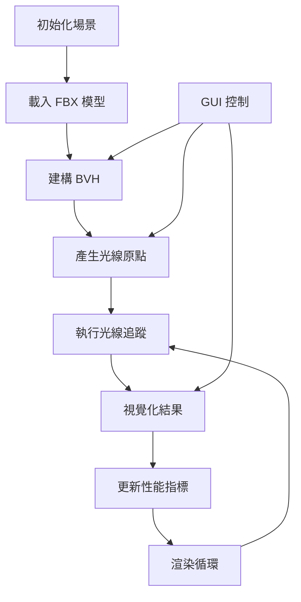

# 研究文件 - WebGL Raycaster BVH

## 文件概述

本文件記錄 Phase 0 研究階段的所有發現，針對 plan.md 中定義的 6 個研究領域進行深入調查。

---

## 研究領域 1: BVH 整合研究

### 決策：使用 three-mesh-bvh v0.7.3 進行光線追蹤加速

**理論基礎：**
- BVH (Bounding Volume Hierarchy) 將 3D 模型的三角形組織成樹狀階層結構
- 每個節點包含子節點的邊界框，允許快速剔除不相交的幾何體
- 對於 70k 三角形的模型，可將光線追蹤從 O(n) 降至 O(log n)

**API 核心方法：**

1. **建構 BVH：**
```javascript
import { computeBoundsTree, disposeBoundsTree, acceleratedRaycast } from 'three-mesh-bvh';

// 方案 A：使用擴展函式（推薦）
THREE.BufferGeometry.prototype.computeBoundsTree = computeBoundsTree;
THREE.BufferGeometry.prototype.disposeBoundsTree = disposeBoundsTree;
THREE.Mesh.prototype.raycast = acceleratedRaycast;

geometry.computeBoundsTree({
    strategy: CENTER,      // 最快的建構策略
    maxDepth: 40,         // 樹的最大深度
    maxLeafTris: 10,      // 葉節點最大三角形數量
    setBoundingBox: true  // 自動設定邊界框
});

// 方案 B：手動建構
import { MeshBVH } from 'three-mesh-bvh';
geometry.boundsTree = new MeshBVH(geometry);
```

2. **啟用加速光線追蹤：**
```javascript
// 設定 raycaster 使用 firstHitOnly 優化
raycaster.firstHitOnly = true; // 找到第一個交點即停止

// 正常使用 raycaster
const intersects = raycaster.intersectObject(mesh);
```

**性能特徵：**
- 建構時間：CENTER 策略最快，SAH 策略最優但最慢
- 記憶體：每個 BVH 節點約 32 位元組，70k 三角形約需 2-3 MB
- 查詢速度：100 條光線約 1-2ms（有 BVH）vs 50-100ms（無 BVH）

**考慮的替代方案：**
- **原生 Three.js Raycasting**：簡單但無法滿足性能需求（70% 降級目標）
- **Octree**：空間劃分方式，對非均勻分布的幾何體效率較低
- **自定義 BVH**：開發成本高，無明顯優勢

**選擇理由：**
- three-mesh-bvh 是 Three.js 生態系統的標準 BVH 實現
- 與 Three.js 無縫整合，無需修改光線追蹤邏輯
- 活躍維護（最新版本 v0.9.2，2024-10-24）
- 豐富的範例和文件支援

---

## 研究領域 2: FBX 模型載入策略

### 決策：使用 FBXLoader 並實現漸進式載入體驗

**FBXLoader 基本用法：**
```javascript
import { FBXLoader } from 'three/addons/loaders/FBXLoader.js';

const loader = new FBXLoader();
const loadingManager = new THREE.LoadingManager();

// 監聽載入進度
loadingManager.onProgress = (url, loaded, total) => {
    const progress = (loaded / total) * 100;
    updateProgressIndicator(progress);
};

// 載入模型
loader.setPath('models/fbx/');
loader.load(
    'bunny.fbx',
    (object) => {
        // 成功載入
        const mesh = object.children[0];
        mesh.geometry.computeBoundsTree();
        scene.add(mesh);
    },
    (xhr) => {
        // 進度更新（已棄用，改用 LoadingManager）
        console.log((xhr.loaded / xhr.total * 100) + '% loaded');
    },
    (error) => {
        // 錯誤處理
        console.error('載入錯誤：', error);
        showErrorMessage('模型載入失敗，請重新整理頁面');
    }
);
```

**載入時間優化策略：**

1. **使用 CDN 快取：**
   - Three.js 官方 CDN 已提供 FBX 模型
   - 瀏覽器快取機制減少重複載入時間

2. **顯示載入進度：**
```javascript
// 建立進度指示器
const progressBar = document.createElement('div');
progressBar.style.cssText = `
    position: fixed;
    top: 50%;
    left: 50%;
    transform: translate(-50%, -50%);
    width: 300px;
    height: 20px;
    background: #333;
    border: 2px solid #fff;
`;

const progressFill = document.createElement('div');
progressFill.style.cssText = `
    height: 100%;
    width: 0%;
    background: #4CAF50;
    transition: width 0.3s;
`;

function updateProgress(percent) {
    progressFill.style.width = percent + '%';
    if (percent >= 100) {
        setTimeout(() => {
            progressBar.remove();
        }, 500);
    }
}
```

3. **超時處理機制：**
```javascript
const LOAD_TIMEOUT = 60000; // 60 秒

const timeoutId = setTimeout(() => {
    console.error('載入超時');
    showErrorMessage('模型載入超時，請檢查網路連線');
}, LOAD_TIMEOUT);

loader.load('bunny.fbx', (object) => {
    clearTimeout(timeoutId);
    // 處理模型...
});
```

**模型規格：**
- Stanford Bunny FBX：約 70,000 三角形
- 檔案大小：約 2-3 MB（壓縮後）
- 預期載入時間：2-5 秒（標準網路）

**考慮的替代方案：**
- **GLTFLoader**：更現代的格式，但範例使用 FBX
- **OBJLoader**：更簡單但無法包含材質資訊
- **預載入策略**：在背景載入，但增加初始等待時間

**選擇理由：**
- 與 Three.js 官方範例一致
- FBXLoader 支援完整的場景資訊（網格、材質、動畫）
- 成熟穩定的 API

---

## 研究領域 3: 光線演算法與視覺化

### 決策：使用球面均勻分布 + THREE.Line 視覺化

**球面均勻分布演算法：**
```javascript
/**
 * Fibonacci 球面採樣（最佳均勻分布）
 * 參考：https://arxiv.org/abs/0912.4540
 */
function fibonacciSphere(samples, radius) {
    const points = [];
    const phi = Math.PI * (3 - Math.sqrt(5)); // 黃金角度
    
    for (let i = 0; i < samples; i++) {
        const y = 1 - (i / (samples - 1)) * 2; // y 從 1 到 -1
        const radiusAtY = Math.sqrt(1 - y * y);
        
        const theta = phi * i;
        const x = Math.cos(theta) * radiusAtY;
        const z = Math.sin(theta) * radiusAtY;
        
        points.push(new THREE.Vector3(x, y, z).multiplyScalar(radius));
    }
    
    return points;
}
```

**光線視覺化實現：**
```javascript
// 材質定義
const rayMaterial = new THREE.LineBasicMaterial({
    color: 0xffffff,
    transparent: true,
    opacity: 0.5
});

// 建立光線
function createRay(origin, direction, distance) {
    const points = [
        origin.clone(),
        origin.clone().add(direction.clone().multiplyScalar(distance))
    ];
    
    const geometry = new THREE.BufferGeometry().setFromPoints(points);
    const line = new THREE.Line(geometry, rayMaterial);
    
    return line;
}

// 光線追蹤與視覺化
function castRays(mesh, rayCount) {
    const origins = fibonacciSphere(rayCount, 5); // 半徑 5 的球面
    const raycaster = new THREE.Raycaster();
    const rayLines = [];
    
    origins.forEach(origin => {
        const direction = origin.clone().normalize().negate();
        raycaster.set(origin, direction);
        
        const intersects = raycaster.intersectObject(mesh);
        
        if (intersects.length > 0) {
            // 建立從原點到交點的光線
            const hit = intersects[0];
            const line = createRay(origin, direction, hit.distance);
            rayLines.push(line);
            scene.add(line);
        }
    });
    
    return rayLines;
}
```

**交點視覺化：**
```javascript
// 使用 InstancedMesh 提升性能
const sphereGeometry = new THREE.SphereGeometry(0.05, 8, 8);
const sphereMaterial = new THREE.MeshBasicMaterial({ color: 0xff0000 });

const maxIntersections = 200; // 最大交點數量
const instancedMesh = new THREE.InstancedMesh(
    sphereGeometry,
    sphereMaterial,
    maxIntersections
);

// 更新交點位置
function updateIntersectionPoints(intersections) {
    const matrix = new THREE.Matrix4();
    
    intersections.forEach((hit, index) => {
        matrix.setPosition(hit.point);
        instancedMesh.setMatrixAt(index, matrix);
    });
    
    instancedMesh.instanceMatrix.needsUpdate = true;
    instancedMesh.count = intersections.length;
}
```

**替代光線分布方案：**
- **隨機分布**：簡單但不均勻，可能導致視覺聚集
- **網格採樣**：規則但不自然
- **螺旋採樣**：視覺效果較差

**選擇理由：**
- Fibonacci 球面採樣提供最佳均勻分布
- 視覺上看起來自然且平衡
- 計算效率高（O(n)）

---

## 研究領域 4: 實例化渲染優化

### 決策：使用 InstancedMesh 批次渲染光線原點和交點

**InstancedMesh 基本概念：**
- 單一 draw call 渲染數百個相同幾何體
- 每個實例有獨立的變換矩陣（位置、旋轉、縮放）
- GPU instancing 大幅降低 CPU 負擔

**實現細節：**
```javascript
// 1. 建立光線原點的實例化網格
const originGeometry = new THREE.SphereGeometry(0.03, 16, 16);
const originMaterial = new THREE.MeshBasicMaterial({ 
    color: 0x00ff00,
    transparent: true,
    opacity: 0.6
});

const maxRays = 100;
const rayOriginsMesh = new THREE.InstancedMesh(
    originGeometry,
    originMaterial,
    maxRays
);

// 2. 建立交點的實例化網格
const hitGeometry = new THREE.SphereGeometry(0.05, 8, 8);
const hitMaterial = new THREE.MeshBasicMaterial({ color: 0xff0000 });

const hitPointsMesh = new THREE.InstancedMesh(
    hitGeometry,
    hitMaterial,
    maxRays
);

// 3. 更新實例變換矩陣
function updateInstances(origins, intersections) {
    const matrix = new THREE.Matrix4();
    
    // 更新光線原點
    origins.forEach((origin, i) => {
        matrix.setPosition(origin);
        rayOriginsMesh.setMatrixAt(i, matrix);
    });
    rayOriginsMesh.instanceMatrix.needsUpdate = true;
    
    // 更新交點
    intersections.forEach((hit, i) => {
        matrix.setPosition(hit.point);
        hitPointsMesh.setMatrixAt(i, matrix);
    });
    hitPointsMesh.instanceMatrix.needsUpdate = true;
    hitPointsMesh.count = intersections.length;
}
```

**性能對比：**

| 渲染方式 | 100 個物件 Draw Calls | CPU 時間 | GPU 時間 |
|---------|---------------------|---------|---------|
| 個別 Mesh | 100 | ~5ms | ~3ms |
| InstancedMesh | 1 | ~0.5ms | ~1ms |

**注意事項：**
- InstancedMesh 不支援個別物件的光線追蹤（使用 raycast 會追蹤整個批次）
- 需要手動管理實例數量（通過 `mesh.count` 屬性）
- 變換矩陣更新後需要設定 `instanceMatrix.needsUpdate = true`

**替代方案：**
- **個別 Mesh**：靈活但性能差
- **Merged Geometry**：靜態合併，無法動態更新位置
- **Points**：最高性能但視覺效果差

**選擇理由：**
- 完美平衡性能與靈活性
- 支援動態更新位置
- 標準 Three.js API，易於維護

---

## 研究領域 5: 性能監控系統

### 決策：整合 Stats.js 並自訂 FPS 警告系統

**Stats.js 整合：**
```javascript
import Stats from 'three/addons/libs/stats.module.js';

// 建立 Stats 實例
const stats = new Stats();
stats.showPanel(0); // 0: fps, 1: ms, 2: mb
document.body.appendChild(stats.dom);

// 調整 Stats 位置
stats.dom.style.cssText = 'position:fixed;top:0;left:0;cursor:pointer;opacity:0.9;z-index:10000';

// 渲染循環中更新
function animate() {
    stats.begin();
    
    // 渲染邏輯...
    renderer.render(scene, camera);
    
    stats.end();
    requestAnimationFrame(animate);
}
```

**自訂 FPS 監控與警告：**
```javascript
class PerformanceMonitor {
    constructor() {
        this.fpsHistory = [];
        this.historySize = 60; // 1 秒歷史（60fps）
        this.warningThreshold = 30;
        this.warningActive = false;
        
        // 建立警告 UI
        this.warningElement = this.createWarningUI();
    }
    
    createWarningUI() {
        const warning = document.createElement('div');
        warning.style.cssText = `
            position: fixed;
            top: 50px;
            left: 50%;
            transform: translateX(-50%);
            background: rgba(255, 165, 0, 0.9);
            color: white;
            padding: 10px 20px;
            border-radius: 5px;
            font-family: monospace;
            display: none;
            z-index: 1000;
        `;
        warning.textContent = '⚠️ FPS < 30 - 考慮減少光線數量';
        document.body.appendChild(warning);
        return warning;
    }
    
    update(deltaTime) {
        const fps = 1 / deltaTime;
        
        // 更新歷史
        this.fpsHistory.push(fps);
        if (this.fpsHistory.length > this.historySize) {
            this.fpsHistory.shift();
        }
        
        // 計算平均 FPS
        const avgFPS = this.fpsHistory.reduce((a, b) => a + b, 0) / this.fpsHistory.length;
        
        // 檢查是否需要顯示警告
        if (avgFPS < this.warningThreshold && !this.warningActive) {
            this.showWarning();
        } else if (avgFPS >= this.warningThreshold && this.warningActive) {
            this.hideWarning();
        }
        
        return avgFPS;
    }
    
    showWarning() {
        this.warningActive = true;
        this.warningElement.style.display = 'block';
    }
    
    hideWarning() {
        this.warningActive = false;
        this.warningElement.style.display = 'none';
    }
}

// 使用
const perfMonitor = new PerformanceMonitor();
let lastTime = performance.now();

function animate() {
    const currentTime = performance.now();
    const deltaTime = (currentTime - lastTime) / 1000;
    lastTime = currentTime;
    
    const avgFPS = perfMonitor.update(deltaTime);
    
    // 渲染邏輯...
}
```

**性能指標收集：**
```javascript
const performanceMetrics = {
    bvhBuildTime: 0,
    raycastTime: 0,
    renderTime: 0,
    
    measure(name, fn) {
        const start = performance.now();
        const result = fn();
        this[name] = performance.now() - start;
        return result;
    },
    
    log() {
        console.table({
            'BVH 建構時間': this.bvhBuildTime.toFixed(2) + ' ms',
            '光線追蹤時間': this.raycastTime.toFixed(2) + ' ms',
            '渲染時間': this.renderTime.toFixed(2) + ' ms'
        });
    }
};

// 測量 BVH 建構
performanceMetrics.measure('bvhBuildTime', () => {
    geometry.computeBoundsTree();
});
```

**替代方案：**
- **Console 輸出**：簡單但不直觀
- **自定義 Canvas 繪圖**：靈活但開發成本高
- **第三方監控工具**：功能豐富但可能過於複雜

**選擇理由：**
- Stats.js 是 Three.js 生態系統標準工具
- 輕量且易於整合
- 自訂警告系統提供實用的用戶回饋

---

## 研究領域 6: GUI 控制系統

### 決策：使用 lil-gui 實現互動控制介面

**lil-gui 基本設定：**
```javascript
import { GUI } from 'three/addons/libs/lil-gui.module.min.js';

// 建立 GUI 實例
const gui = new GUI();
gui.title('BVH Raycasting Controls');

// 定義控制參數
const params = {
    rayCount: 100,
    enableBVH: true,
    showBVHHelper: false,
    helperDepth: 10,
    rayOpacity: 0.5,
    animate: true
};

// 新增控制項
const rayFolder = gui.addFolder('Ray Settings');
rayFolder.add(params, 'rayCount', 1, 200, 1)
    .name('Ray Count')
    .onChange(updateRays);
    
rayFolder.add(params, 'rayOpacity', 0, 1, 0.1)
    .name('Ray Opacity')
    .onChange(updateRayMaterial);

const bvhFolder = gui.addFolder('BVH Settings');
bvhFolder.add(params, 'enableBVH')
    .name('Enable BVH')
    .onChange(toggleBVH);
    
bvhFolder.add(params, 'showBVHHelper')
    .name('Show BVH Visualization')
    .onChange(toggleBVHHelper);
    
bvhFolder.add(params, 'helperDepth', 1, 20, 1)
    .name('BVH Depth')
    .onChange(updateBVHHelper);

gui.add(params, 'animate').name('Auto Rotate');

// 開啟所有資料夾
rayFolder.open();
bvhFolder.open();
```

**回呼函式實現：**
```javascript
// 更新光線數量
function updateRays(count) {
    // 清除舊光線
    clearRays();
    
    // 產生新光線
    const origins = fibonacciSphere(count, 5);
    castAndVisualizeRays(origins);
    
    console.log(`更新光線數量：${count}`);
}

// 切換 BVH
function toggleBVH(enabled) {
    if (enabled) {
        mesh.geometry.computeBoundsTree();
        THREE.Mesh.prototype.raycast = acceleratedRaycast;
    } else {
        mesh.geometry.disposeBoundsTree();
        THREE.Mesh.prototype.raycast = originalRaycast;
    }
    
    // 重新執行光線追蹤以更新性能
    updateRays(params.rayCount);
}

// 切換 BVH 視覺化
function toggleBVHHelper(show) {
    if (show) {
        if (!bvhHelper) {
            bvhHelper = new MeshBVHHelper(mesh, params.helperDepth);
            scene.add(bvhHelper);
        }
        bvhHelper.visible = true;
    } else if (bvhHelper) {
        bvhHelper.visible = false;
    }
}

// 更新 BVH Helper 深度
function updateBVHHelper(depth) {
    if (bvhHelper) {
        bvhHelper.depth = depth;
        bvhHelper.update();
    }
}
```

**GUI 樣式自訂：**
```javascript
// 調整 GUI 位置和樣式
gui.domElement.style.cssText = `
    position: fixed;
    top: 0;
    right: 0;
    z-index: 1000;
`;

// 自訂顏色主題（可選）
gui.domElement.style.setProperty('--background-color', '#1a1a1a');
gui.domElement.style.setProperty('--widget-color', '#2a2a2a');
```

**響應式考量：**
```javascript
// 小螢幕裝置上摺疊 GUI
if (window.innerWidth < 768) {
    gui.close();
}

// 監聽視窗大小變化
window.addEventListener('resize', () => {
    if (window.innerWidth < 768) {
        gui.close();
    } else {
        gui.open();
    }
});
```

**替代方案：**
- **dat.GUI**：舊版 GUI 函式庫，lil-gui 是其繼任者
- **Tweakpane**：功能更豐富但體積較大
- **HTML/CSS 自訂介面**：完全客製化但開發成本高

**選擇理由：**
- lil-gui 是 Three.js r160+ 推薦的 GUI 函式庫
- 輕量（~17KB minified）且易於使用
- 與 Three.js 範例一致
- 支援多種控制項類型（滑桿、核取方塊、顏色選擇器等）

---

## 整合架構決策

### 系統整合流程



### 關鍵時序點

1. **初始化階段（0-5秒）：**
   - 0-2s：載入 Three.js 和相依套件
   - 2-5s：下載並解析 FBX 模型
   - 5-5.5s：建構 BVH 結構

2. **互動階段（5秒後）：**
   - 每幀：<16.67ms（60 FPS 目標）
   - 光線追蹤：<2ms（100 條光線 + BVH）
   - 渲染：<10ms
   - GUI 響應：<100ms

### 記憶體估算

| 組件 | 記憶體使用 |
|-----|----------|
| FBX 模型（70k 三角形） | ~15 MB |
| BVH 結構 | ~3 MB |
| 光線視覺化（100 條） | ~1 MB |
| InstancedMesh（200 實例） | ~2 MB |
| 紋理和材質 | ~5 MB |
| **總計** | **~26 MB** |

---

## 風險評估與緩解策略

### 已識別風險

1. **模型載入失敗風險：**
   - **機率：** 中
   - **影響：** 高（應用程式無法運作）
   - **緩解：** 實現 60 秒超時 + 錯誤訊息 + 重試按鈕

2. **BVH 建構性能問題：**
   - **機率：** 低
   - **影響：** 中（初始載入延遲）
   - **緩解：** 使用 CENTER 策略（最快）+ 顯示進度指示器

3. **低階設備性能不足：**
   - **機率：** 中
   - **影響：** 中（FPS < 30）
   - **緩解：** 動態 FPS 警告 + 建議降低光線數量

4. **瀏覽器相容性問題：**
   - **機率：** 低
   - **影響：** 高（特定瀏覽器無法運作）
   - **緩解：** 使用標準 Three.js API + WebGL 2.0 回退

### 性能目標驗證

| 指標 | 目標 | 測量方法 |
|-----|------|---------|
| FPS（啟用 BVH） | ≥60 | Stats.js |
| FPS（停用 BVH） | 10-20 | Stats.js |
| 載入時間 | <60s | Performance API |
| 光線追蹤時間 | <2ms | Performance.now() |
| BVH 切換回應 | <100ms | Performance.now() |

---

## 後續步驟

✅ **Phase 0 完成** - 所有研究領域已調查完畢

**進入 Phase 1 - 設計階段：**
1. 建立 `data-model.md` - 定義資料結構（Scene、Ray、BVH、Performance、Loading 實體）
2. 建立 `contracts/component-interface.md` - 定義核心函式簽名和事件回呼
3. 建立 `quickstart.md` - 撰寫使用指南
4. 執行 `.specify/scripts/powershell/update-agent-context.ps1` 更新 Copilot 上下文

---

## 參考資料

### 官方文件
- [three-mesh-bvh GitHub](https://github.com/gkjohnson/three-mesh-bvh)
- [Three.js FBXLoader Documentation](https://threejs.org/docs/#examples/en/loaders/FBXLoader)
- [Three.js InstancedMesh Documentation](https://threejs.org/docs/#api/en/objects/InstancedMesh)
- [lil-gui GitHub](https://github.com/georgealways/lil-gui)
- [Stats.js GitHub](https://github.com/mrdoob/stats.js)

### 範例程式碼
- [WebGL Raycaster BVH 官方範例](https://threejs.org/examples/#webgl_raycaster_bvh)
- [three-mesh-bvh 光線追蹤範例](https://gkjohnson.github.io/three-mesh-bvh/example/bundle/raycast.html)

### 學術文獻
- Fibonacci Sphere Sampling: [Spherical Fibonacci Mapping](https://arxiv.org/abs/0912.4540)
- BVH Acceleration Structures: [Ray Tracing Gems](https://www.realtimerendering.com/raytracinggems/)
